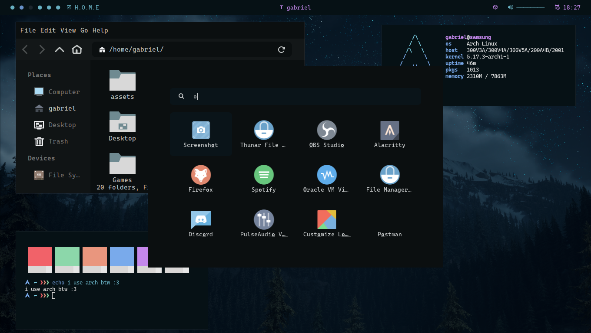

# Night based bspwm config

This is my configuration for bspwm using polybar as bar
and for widgets eww (only vpn widget for now).



## Requirements

Make sure you have this packages installed in your system:

- CaskaydiaCove Nerd Font
- bspwm
- sxhkd
- kitty
- eww
- rofi
- fish
- dunst
- feh
- picom (jonaburg's fork for animations)
- exa
- bat (I didn't remember if for debian based is named 'batcat' check it :3)

## Installation

Simply copy files to the appropiate folders.

### Steps

1. Clone dotfiles:

```sh
git clone https://github.com/AlphaTechnolog/nightbspwm
cd nightbspwm
```

2. Create folders if not exists:

```sh
mkdir -p ~/.config ~/.local/bin
```

3. Copy configurations

```sh
cp -r <pathtonightbspwm>/config/* ~/.config
cp -r <pathtonightbspwm>/bin/* ~/.local/bin
cp -r <pathtonightbspwm>/home/* ~
```

4. Enjoy!
